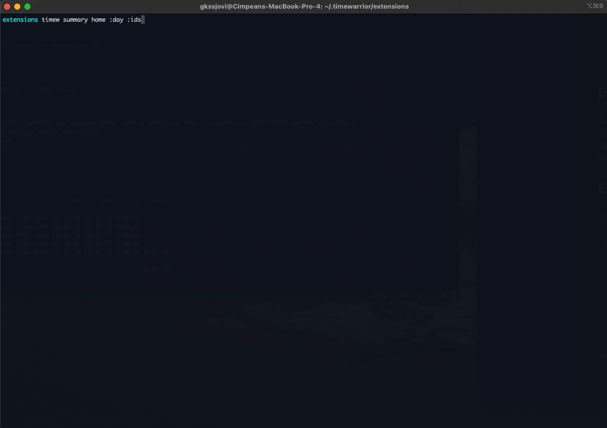

## Description

Those extensions will allow to modify multiple records

| Command                        | Feature                                                               |
|--------------------------------|-----------------------------------------------------------------------|
| `timew delete-tag 'TagName'`   | delete multiple records                                               |
| `timew join-tag 'TagName'`     | join multiple records                                                 |
| `timew collapse-tag 'TagName'` | collapse multiple records - this will sum the time and merge the tags |
| `timew ids 'TagName'`          | get records ids                                                       |

## Installation 

```sh
git clone https://github.com/gkssjovi/timewarrior-extensions.git
cd timewarrior-extensions
cp -r src/. ~/.timewarrior/extensions
cd  ~/.timewarrior/extensions

chmod +x delete-tag.py ids.py join-tag.py collapse-tag.py
```
## Info

To be sure you don't mess things up until learning how command works, make a backup to the `~/.timewarrior/data` folder before you test.\
The actions don't have a confirmation message before are called. \
You can also use the command `timew undo`

## Examples

`timew summary home :week :ids`

```sh
Wk  Date       Day ID Tags                           Start      End    Time   Total
--- ---------- --- -- --------------------------- -------- -------- ------- -------
W43 2021-10-28 Thu @8 Inbox, home, work from home 18:36:16 18:36:28 0:00:12
                   @6 Inbox, home, work from home 18:36:33 18:36:34 0:00:01
                   @5 Inbox, home, work from home 18:36:34 18:36:35 0:00:01
                   @4 Inbox, home, work from home 18:36:36 18:36:37 0:00:01
                   @2 Inbox, home, work from home 18:36:39 18:36:40 0:00:01 0:00:16

                                                                            0:00:16

```


`timew ids home :week` 


```sh
@8 @6 @5 @4 @2
```


---

`timew delete $(timew ids home :week)`


``` sh
Deleted @2
Deleted @4
Deleted @5
Deleted @6
Deleted @8
```
---

`timew join-tag home :day`
``` sh
Joined @2 and @3
Joined @1 and @2

Before join command:

Wk  Date       Day ID Tags                           Start      End    Time   Total
--- ---------- --- -- --------------------------- -------- -------- ------- -------
W43 2021-10-28 Thu @3 Inbox, home, work from home 18:46:29 18:46:30 0:00:01
                   @2 Inbox, home, work from home 18:46:31 18:46:32 0:00:01
                   @1 Inbox, home, work from home 18:46:33 18:46:34 0:00:01 0:00:03

                                                                            0:00:03
After join command:

Wk  Date       Day ID Tags                           Start      End    Time   Total
--- ---------- --- -- --------------------------- -------- -------- ------- -------
W43 2021-10-28 Thu @1 Inbox, home, work from home 18:46:29 18:46:34 0:00:05 0:00:05

                                                                            0:00:05
```


---

`timew collapse-tag home :week`

``` sh 
Deleted @2
Deleted @3
Deleted @4
Deleted @5
Deleted @6
Added Inbox home work home to @1

Before collapse command:

Wk  Date       Day ID Tags                           Start      End    Time   Total
--- ---------- --- -- --------------------------- -------- -------- ------- -------
W43 2021-10-28 Thu @6 Inbox, home, work from home 22:27:19 22:27:20 0:00:01
                   @5 Inbox, home, work from home 22:27:21 22:27:23 0:00:02
                   @4 Inbox, home, work from home 22:27:24 22:27:26 0:00:02
                   @3 Inbox, home, work from home 22:27:27 22:27:28 0:00:01
                   @2 Inbox, home, work from home 22:27:29 22:27:30 0:00:01
                   @1 Inbox, home, work from home 22:27:31 22:27:32 0:00:01 0:00:08

                                                                            0:00:08
After collapse command:

Wk  Date       Day ID Tags                                 Start      End    Time   Total
--- ---------- --- -- --------------------------------- -------- -------- ------- -------
W43 2021-10-28 Thu @1 Inbox, home, work, work from home 22:27:24 22:27:32 0:00:08 0:00:08

                                                                                  0:00:08
```

---
`timew delete-tag home :day`

``` sh 
Wk  Date       Day ID  Tags                           Start      End    Time   Total
--- ---------- --- --- --------------------------- -------- -------- ------- -------
W43 2021-10-28 Thu @10 Inbox, home, work from home 18:46:29 18:50:28 0:03:59
                   @9  Inbox, home, work from home 18:53:06 18:53:07 0:00:01
                   @8  Inbox, home, work from home 18:53:08 18:53:09 0:00:01
                   @7  Inbox, home, work from home 18:53:10 18:53:11 0:00:01
                   @6  Inbox, home, work from home 18:53:11 18:53:12 0:00:01
                   @5  Inbox, home, work from home 18:53:12 18:53:13 0:00:01
                   @4  Inbox, home, work from home 18:53:13 18:53:14 0:00:01
                   @3  Inbox, home, work from home 18:53:15 18:53:17 0:00:02
                   @2  Inbox, home, work from home 18:53:17 18:53:18 0:00:01
                   @1  Inbox, home, work from home 18:53:18 18:53:19 0:00:01 0:04:09

                                                                             0:04:09
```

---
